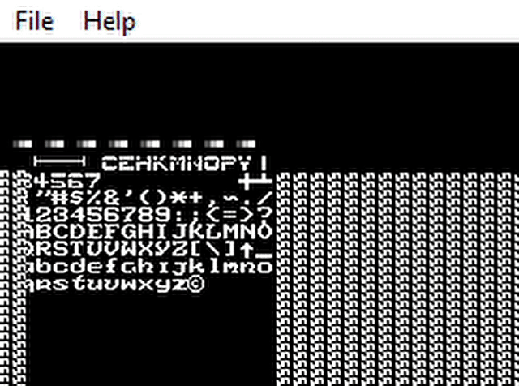

# NES_Emulator

## Currently Tested:
1. SRAM/WRAM - Passed
2. CPU/R-MOS-6502 - Passed
3. Cartridge ROM Loading [.nes/ines 1.0] - Passed
4. Mapper 0 - Testing
5. PPU/R-MOS-2C02 - Testing
6. Output Window - Testing
7. Timing - Later...

#### Credit to javidx9 [not a clone of his olc_nes project] for his basic overview explanation of the Nintendo Entertainment System, NesHacker for his in-depth explanations and all the people behind the NesDev Wiki Reference Guide for it's documentations.

##### Copyright of the Hardware belongs to Nintendo, 1985.
